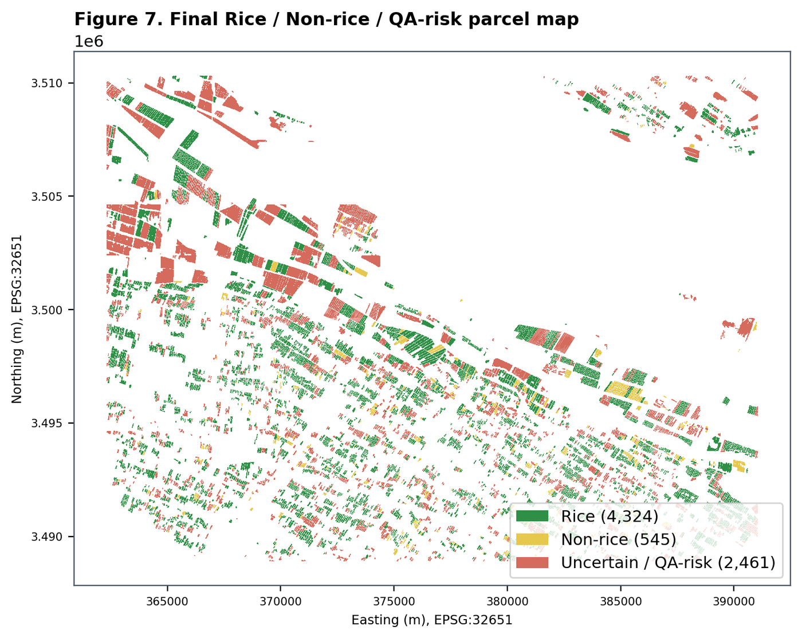
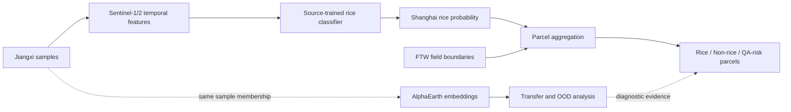
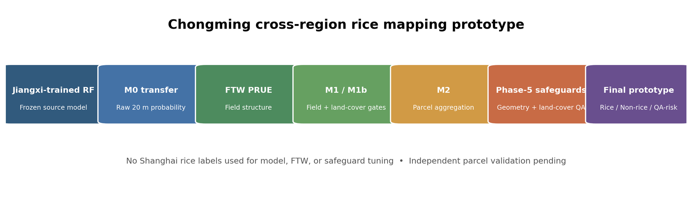
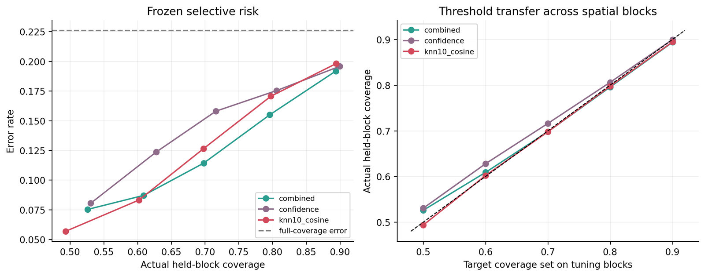
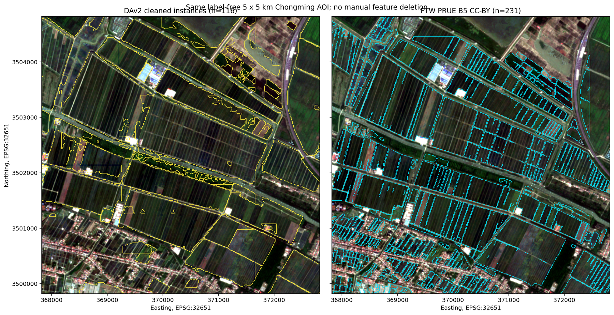
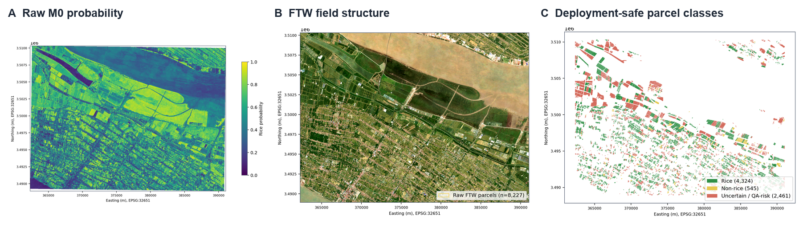

# Cross-Region Parcel-Level Rice Mapping

### From Jiangxi-trained rice models to field-level mapping in Chongming, Shanghai

This project started with a simple question: **how well does a rice classifier trained in Jiangxi transfer to Shanghai?** I first tested direct Sentinel-1/2 transfer, then used AlphaEarth embeddings and out-of-distribution (OOD) distance to examine where the model was more likely to fail. A later extension converted the pixel predictions into field-level maps for Chongming using FTW field boundaries and simple quality-control rules.



The current Chongming map is a deployment prototype, not an independently validated Shanghai rice map. Shanghai sample-level scores use an official product as a weak reference.

## Main questions

1. How much performance is lost when a Jiangxi-trained model is applied directly to Shanghai?
2. Do AlphaEarth embeddings transfer better than the original Sentinel-1/2 temporal features?
3. Can distance from the Jiangxi training distribution identify risky Shanghai predictions?
4. Can pixel predictions be converted into more useful field-level outputs without retraining the rice classifier?

## Workflow





## Cross-region transfer

The controlled source study contains 1,429 Jiangxi rice/non-rice samples split with group-disjoint spatial blocks. The Shanghai study uses 12,000 balanced product-derived samples, with separate target-pool and target-validation blocks.

The Sentinel representation contains 92 temporal features: 23 Sentinel-2 NDVI observations and 23 observations each of Sentinel-1 VV, VH, and RVI. The same sample membership was also represented using 64-dimensional 2022 AlphaEarth embeddings.

| Experiment | Sentinel temporal | AlphaEarth |
|---|---:|---:|
| Jiangxi source-test F1 | 0.947 | **0.962** |
| Shanghai zero-shot F1* | 0.813 | **0.836** |
| Shanghai with 500 weak labels* | 0.854 | **~0.895** |

\*Shanghai values measure agreement with an official-product weak reference, not independent field accuracy.

The zero-shot ordering is not universal: on a stricter product-derived subset, temporal features slightly outperform AlphaEarth. I therefore treat AlphaEarth as a useful transfer representation rather than as an automatic replacement for the Sentinel time series.

## OOD and prediction risk

A Jiangxi-vs-Shanghai domain classifier separates the two regions almost perfectly, but that probability is not useful for ranking which individual Shanghai samples are likely to be wrong. Distance to the Jiangxi representation space is much more informative.

- Best OOD error AUROC: **0.800**.
- Nearest vs. farthest 10-NN risk deciles: about **1.1% vs. 50.2%** weak-reference disagreement.
- Domain-classifier probability: error AUROC **0.415**, despite domain AUROC near 1.0.
- OOD-only selective prediction can reduce disagreement substantially by abstaining on high-risk samples.



Several approaches did not help. Three rounds of pseudo-labeling reduced temporal weak-reference F1 from 0.813 to 0.795, and directly concatenating the 92 temporal features with AlphaEarth overfit under small target-label budgets. PCA reduced the penalty but did not outperform AlphaEarth alone.

More details are in [experiments.md](docs/experiments.md) and [experiment_history.md](docs/experiment_history.md).

## Parcel-level extension

The source-only 20 m Sentinel probability raster was then used as the input to a field-level mapping experiment in Chongming. The rice model and its 0.50 threshold were kept unchanged during this step.

I compared Delineate Anything v2 with FTW PRUE on the same 5 × 5 km label-free AOI. DAv2 often merged multiple visible fields into very large objects, while FTW preserved substantially more narrow-field structure, so FTW was used for the final parcel experiment.



The field boundaries were aligned with the rice-probability raster and used to summarize probability by parcel. Additional rules flag obvious water, built-up, extreme-area, overlap, tile-edge, and other geometry problems without using Shanghai rice labels.

| Parcel measure | Before QA | After QA |
|---|---:|---:|
| Parcel objects | 8,227 | 7,330 |
| Objects over 50 ha | 28 | 0 |
| Residual positive-area overlaps | 6 | 0 |
| Water-dominant area | 5,477.04 ha | 56.65 ha |

These changes describe **where the model output is allowed to be used**, not measured classification-error removal.



## What is currently validated

The project supports conclusions about:

- Jiangxi source performance;
- weak-reference transfer from Jiangxi to Shanghai;
- AlphaEarth vs. Sentinel representation behavior;
- OOD risk ranking and selective prediction;
- field geometry and parcel aggregation;
- label-independent QA for the Chongming deployment prototype;
- wall-to-wall weak-reference consistency of the deployment products (consistency with an official product, not independent accuracy).

It does **not** yet support independent Shanghai parcel precision, recall, F1, accuracy, or area accuracy. A 400-parcel validation sample has been prepared, but its reference-label fields are intentionally blank until independent labels are collected. See [validation.md](docs/validation.md).

## Wall-to-wall deployment evaluation

The full deployment products were evaluated against the official Shanghai rice
product as a **weak reference** — a consistency and coverage check, not
independent accuracy. All rasters are co-registered (EPSG:32651, 20 m, 1,500,751
pixels), so no resampling was needed and predicted rice area is invariant between
the two evaluation modes below.

| Product | Mode A F1 | Mode B F1 | Spatial retention |
|---|---:|---:|---:|
| M0 raw transfer | 0.329 | 0.329 | 100% |
| M1 FTW-gated | 0.510 | 0.602 | 28.1% |
| M1b FTW + Dynamic World | 0.528 | 0.648 | 15.7% |
| M2 parcel | 0.359 | 0.621 | 8.7% |
| M2 QA | 0.359 | 0.621 | 8.7% |

- **Mode A** (full-grid): abstained/excluded pixels are scored as predicted
  non-rice — the whole-map reading.
- **Mode B** (conditional): agreement is measured only on pixels each product
  retains; a conditional subset statistic, not a same-population improvement over
  M0.

The weak-reference F1 is low mainly because precision is the binding term (M0
precision 0.202): the official reference is sparse (7,134 ha within the M0
region) while the deployment products are wall-to-wall, so most predicted rice
falls outside the reference footprint. This reflects false-positive rice
predictions under low rice prevalence, not a recall failure — recall is high
(0.88). M2 and M2 QA produce identical masks, so QA does not change the
weak-reference score. A block-level paired analysis (full details in
[`results/summary/wall_to_wall_weak_reference_report.md`](results/summary/wall_to_wall_weak_reference_report.md)
and [`docs/experiments.md`](docs/experiments.md)) shows M1/M1b improve block-level
F1 versus M0 in roughly 63–66% of blocks, while M2/M2 QA are neutral.

## Reproducing the project

```bash
python -m venv .venv
# activate the environment, then:
pip install -e ".[dev]"
python scripts/check_data.py
python -m pytest -q
```

Large imagery, external model checkpoints, the official Shanghai reference raster, and generated GeoTIFF/GPKG products are not stored in Git. Public collection IDs, reconstruction scripts, file manifests, and expected missing-data behavior are documented in [DATA_AVAILABILITY.md](DATA_AVAILABILITY.md).

## Repository structure

```text
assets/figures/          main project figures
configs/                 experiment configurations
data/                    small public examples
data_metadata/           manifests and data registry
docs/                    methods, experiments, validation, history
gee/                     Sentinel and AlphaEarth export scripts
src/                     modeling, transfer, OOD, and analysis code
scripts/parcel_mapping/  field delineation and parcel mapping
results/                 selected tables, manifests, and examples
tests/                   split, manifest, portability, and area tests
```

## Limitations

- Shanghai evaluation currently relies on an official-product weak reference rather than independent field truth.
- The wall-to-wall weak-reference F1 measures consistency with an official product, not field accuracy; its low value reflects the frozen source model's many false-positive rice predictions under low rice prevalence (precision 0.202), not a recall failure — recall is high (0.88).
- The deployment prototype covers central/eastern Chongming rather than all of Shanghai.
- FTW boundaries are useful agricultural field approximations, not cadastral truth.
- Ten-metre field delineation and 20 m rice probabilities cannot resolve every narrow bund, ditch, or tiny parcel.
- AlphaEarth OOD analysis is sample-based; this repository does not claim a wall-to-wall Shanghai OOD surface.
- A filtered or excluded parcel should not be interpreted automatically as a classification error.

## Documentation

- [Methodology](docs/methodology.md)
- [Experiments and ablations](docs/experiments.md)
- [Validation protocol](docs/validation.md)
- [Earlier experiments and project history](docs/experiment_history.md)
- [Selected public result files](results/README.md)

## License and acknowledgements

Project code is released under the [MIT License](LICENSE). External datasets and pretrained weights retain their own licenses. The project uses Google Earth Engine public collections, Sentinel-1/2 imagery, AlphaEarth annual embeddings, Dynamic World, Fields of the World FTW PRUE, and Delineate Anything v2. See [methodology.md](docs/methodology.md) for versions and implementation details.
