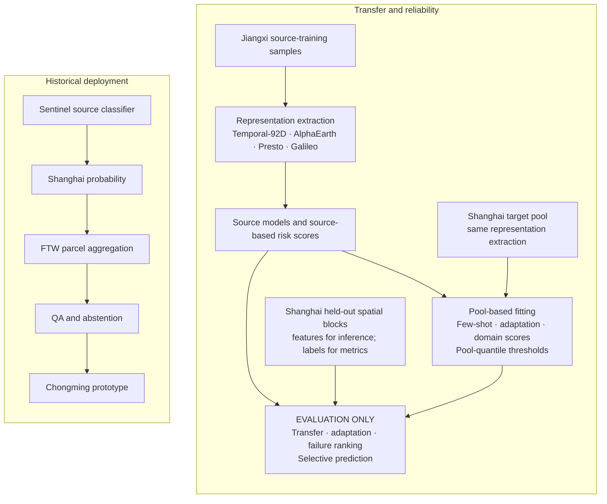

# Cross-Region Rice Mapping under Geographic Domain Shift

### EO representations, target supervision, adaptation, reliability and parcel deployment

This project studies how rice mapping models generalize from Jiangxi to Shanghai
under geographic domain shift. It compares Earth-observation representation
systems, limited target supervision and simple domain adaptation, then examines
prediction reliability, failure detection and selective prediction. A Chongming
parcel-mapping prototype connects transferred pixel probabilities with field
boundaries and label-independent quality checks.

Shanghai metrics measure agreement with an **external rice-map product, not
independent field truth**. Its publisher and citation are not established in the
retained records; see [reference provenance](DATA_AVAILABILITY.md#shanghai-reference-provenance).


*Chongming parcel-mapping prototype: predicted Rice, Non-rice and Uncertain / QA-risk parcels; independent field validation remains pending.*

[Research results](RESULTS.md) · [Four-representation benchmark](#four-representation-benchmark) · [Reliability](#adaptation-and-prediction-reliability) · [Parcel deployment](#parcel-level-deployment) · [Reproduction](#reproducing-the-project)

## Key findings

- Four EO representation systems share sample membership and spatial splits;
  all paired zero-shot intervals include zero, so no clear winner is established.
- AlphaEarth shows stronger few-shot behavior under the tested distributed
  weak-label protocol; this is not an estimate of real-world annotation savings.
- CORAL and fixed single-round self-training do not improve transfer in the
  tested settings; this does not establish that domain adaptation generally fails.
- Separating Jiangxi from Shanghai is different from ranking prediction failures:
  AlphaEarth cosine 10-NN distance is more informative than domain probability.

These Shanghai findings describe product agreement, not independent field accuracy.

## Main questions

1. How well do Jiangxi-trained rice models transfer to Shanghai?
2. How do Temporal-92D, AlphaEarth, Presto and Galileo behave under geographic shift?
3. How much target supervision is needed to recover transfer performance?
4. Do simple unsupervised adaptation methods improve cross-region transfer?
5. Can risk scores identify unreliable predictions and support selective prediction?
6. Can transferred pixel predictions support useful parcel-level deployment products?

## Workflow



Shanghai held-out blocks enter evaluation only. Unsupervised adaptation uses
target-pool features; supervised few-shot labels come only from that pool.
Pool-quantile thresholds use pool scores, not held-out outcomes. Representation
extraction is applied separately to each split, with training-only preprocessing
as specified in the [protocol](docs/geoai_research_protocol.md).
Reliability results use source-only rice predictions. The separate parcel
prototype retains the original Sentinel model and has no wall-to-wall OOD layer.

## Historical cross-region transfer

The historical study uses 1,429 Jiangxi samples and 12,000 balanced Shanghai
product-derived samples, with group-disjoint source splits and separate Shanghai
pool and evaluation blocks. It compares Sentinel temporal features with annual
AlphaEarth embeddings.

| Historical experiment | Sentinel temporal | AlphaEarth |
|---|---:|---:|
| Jiangxi source-test F1 | 0.947 | 0.962 |
| Shanghai zero-shot F1* | 0.813 | 0.836 |

\*Product agreement. These [historical headline values](results/summary/headline_metrics.csv)
use the original Temporal data; the benchmark below uses rebuilt Temporal and
multi-seed means.
The ordering reverses on a stricter product-derived subset; the historical
pseudo-labeling and feature-concatenation experiments also retain negative results.
See [experiments and ablations](docs/experiments.md).

### Historical OOD diagnostic

The earlier distance diagnostic reports a **maximum error AUROC of 0.800** at
the precision retained in the [historical table](results/summary/headline_metrics.csv).
Its domain-classifier and rejection protocols are described in
[the historical OOD analysis](docs/experiments.md#historical-ood-and-calibration).
The controlled cosine 10-NN result below is **0.797663**. These values belong to
different score comparisons and domain-classifier protocols; the
[evidence guide](docs/readme_evidence.md) keeps the versions separate.

## Four-representation benchmark

Temporal-92D (rebuilt), AlphaEarth, monthly Presto and Galileo use the same
13,429 locations: 850 source-training, 265 source-validation, 314 source-test,
9,249 target-pool and 2,751 held-out Shanghai samples. The benchmark includes
2,400 few-shot fits with shared draws and paired spatial-block intervals.

| Representation | Jiangxi source-test F1 | Shanghai zero-shot F1* | 500 distributed weak labels, target-only F1* |
|---|---:|---:|---:|
| Temporal-92D (rebuilt) | 0.959479 | 0.814868 | 0.859394 |
| AlphaEarth | 0.964815 | 0.836000 | 0.898126 |
| Presto (monthly) | 0.948728 | 0.826249 | 0.884001 |
| Galileo | 0.941607 | 0.822096 | 0.861694 |

\*Shanghai weak-reference agreement. Values are rounded from the
[saved representation table](results/geoai_rqs_v1/table1_representation.csv).
Source and zero-shot means use 3 fixed seeds; few-shot means use 30 shared draws.
All six zero-shot paired intervals include zero. Clustered label collection
produces lower means and greater variability under the tested samplers.

Under the tested distributed weak-label protocol, AlphaEarth with 50 target
labels achieved mean F1 **0.870594**, while Temporal-92D with 500 achieved
**0.859394** (target-only training). This indicates stronger few-shot behavior
in this experiment, not a demonstrated 10× reduction in real-world annotation
effort. Budgets were sampled independently, and acquiring balanced labels can
require additional search or annotation.


The representation systems have different upstream inputs, and Temporal is a
reconstruction rather than the historical source table. The research extension
adds 80 fits at 250 labels using five shared draws; it preserves the earlier
2,400 fits. See the [benchmark case study](docs/eofm_benchmark_case_study.md),
[reproduction guide](docs/eofm_benchmark_reproduction.md) and [full results](RESULTS.md).

## Adaptation and prediction reliability

**Simple adaptation gives useful negative results.** With matched 500-tree RFs
and five seeds, CORAL and fixed single-round self-training reduce mean F1 for all
four representations. Importance weighting provides no consistent recovery:
Galileo rises from **0.821962 to 0.829897**, while Temporal's change is only
**+0.000507** and AlphaEarth and Presto decline. Most ratios hit the clipping
floor for Temporal, AlphaEarth and Presto; Galileo's effective source sample size
falls to **43.24**. AlphaEarth's weights are uniform, and its small change comes
from the RF bootstrap sampling path rather than useful density correction.
These findings are specific to the tested settings. Adaptation means use five
seeds; the representation table above uses three source seeds.
See the [adaptation table](results/geoai_rqs_v1/table2_adaptation.csv) and
[weight diagnostics](results/geoai_rqs_v1/importance_diagnostics.csv).

**Domain separation is not error detection.** In the controlled reliability
study, AlphaEarth's domain classifier has domain AUROC **0.999999** but
error AUROC **0.463006**. Cosine 10-NN distance instead reaches error AUROC
**0.797663**. All are rounded from the [saved risk scores](results/geoai_rqs_v1/rq3_scores.csv).
The study compares eleven scores per representation on source-only predictions;
distance is not equally useful for every representation.

**Selective prediction:** accepting the lowest-risk half of AlphaEarth
predictions by cosine 10-NN distance reduces weak-reference disagreement from
**22.79% to 5.38%** (actual retained coverage **50.018%**, because counts are
discrete). This is offline ranking behavior, not a guaranteed deployment error
bound or a conformal coverage claim. Pool-selected thresholds are evaluated
separately. Read [RESULTS.md](RESULTS.md) for the comparisons and curves, or the
[research protocol](docs/geoai_research_protocol.md) for fitting and selection rules.

## Parcel-level deployment

The historical source-only 20 m Sentinel probability raster is used as the input to a field-level mapping experiment in Chongming. The rice model and its 0.50 threshold were kept unchanged during this step.

I compared Delineate Anything v2 with FTW PRUE on the same 5 × 5 km label-free AOI. DAv2 often merged multiple visible fields into very large objects, while FTW preserved substantially more narrow-field structure, so FTW was used for the final parcel experiment.


The field boundaries were aligned with the rice-probability raster and used to summarize probability by parcel. Additional rules flag obvious water, built-up, extreme-area, overlap, tile-edge, and other geometry problems without using Shanghai rice labels.

| Parcel measure | Before QA | After QA |
|---|---:|---:|
| Parcel objects | 8,227 | 7,330 |
| Objects over 50 ha | 28 | 0 |
| Residual positive-area overlaps | 6 | 0 |
| Water-dominant area | 5,477.04 ha | 56.65 ha |

These changes describe **where the model output is allowed to be used**, not measured classification-error removal.


## Validation scope

The project supports conclusions about:

- Jiangxi source performance;
- weak-reference transfer from Jiangxi to Shanghai;
- matched four-representation behavior and target-label efficiency;
- controlled simple adaptation, including negative results;
- OOD risk ranking and selective prediction;
- field geometry and parcel aggregation;
- label-independent QA for the Chongming deployment prototype;
- wall-to-wall weak-reference consistency of the deployment products (consistency with an external rice-map product, not independent accuracy).

It does **not** yet support independent Shanghai parcel precision, recall, F1, accuracy, or area accuracy. A 400-parcel validation sample has been prepared, but its reference-label fields are intentionally blank until independent labels are collected. See [validation.md](docs/validation.md).

## Wall-to-wall deployment evaluation

The full deployment products were evaluated against the external Shanghai rice-map
product as a **weak reference** — a consistency and coverage check, not
independent accuracy. All rasters are co-registered (EPSG:32651, 20 m, 1,500,751
pixels), so no resampling was needed and predicted rice area is invariant between
the two evaluation modes below.

| Product | Mode A F1 | Mode B F1 | Spatial retention |
|---|---:|---:|---:|
| M0 raw transfer | 0.329 | 0.329 | 100% |
| M1 FTW-gated | 0.510 | 0.602 | 28.1% |
| M1b FTW + Dynamic World | 0.528 | 0.648 | 15.7% |
| M2 parcel | 0.359 | 0.621 | 8.7% |
| M2 QA | 0.359 | 0.621 | 8.7% |

- **Mode A** (full-grid): abstained/excluded pixels are scored as predicted
  non-rice — the whole-map reading.
- **Mode B** (conditional): agreement is measured only on pixels each product
  retains; a conditional subset statistic, not a same-population improvement over
  M0.

For M0, low weak-reference F1 is driven by precision (**0.202**) despite recall
of **0.882**. The reference labels **7,134.28 ha** as rice within the evaluated
footprint; rice prevalence is low, and many predicted rice pixels are reference
non-rice. These count as false positives against the evaluated product, not
verified field errors. The aligned raster has no nodata, but its preparation
assigns zero to empty destinations; that does not establish the original
product's coverage completeness. See the [provenance and alignment limits](DATA_AVAILABILITY.md#shanghai-reference-provenance).
M2 and M2 QA produce identical masks, so QA does not change the
weak-reference score. A block-level paired analysis (full details in
[wall-to-wall report](results/summary/wall_to_wall_weak_reference_report.md)
and [`docs/experiments.md`](docs/experiments.md)) shows M1/M1b improve block-level
F1 versus M0 in 22/35 and 21/32 evaluable blocks, respectively; M2/M2 QA have median change zero.

Values come from the [wall-to-wall metric table](results/tables/wall_to_wall_weak_reference_metrics.csv), [paired block summary](results/tables/wall_to_wall_block_summary.csv) and [alignment audit](results/summary/wall_to_wall_alignment_audit.json).

## Reproducing the project

```bash
python -m venv .venv
# Activate the environment, then choose one installation:

# Core development without Earth Engine recovery utilities
pip install -e ".[dev]"

# Full repository test suite, matching GitHub Actions
pip install -e ".[dev,earthengine]"
```

Use `.[dev]` for core/local development that does not exercise Earth Engine
recovery utilities. The full test suite requires `.[dev,earthengine]`; install
it directly without first installing `.[dev]`. Then run:

```bash
python scripts/check_data.py
python -m pytest -q
python scripts/validate_release.py
python scripts/validate_geoai_results.py
python -m compileall -q src scripts
```

Missing large raster/runtime files reported by `scripts/check_data.py` are expected in a clean Git clone. Large imagery, external model checkpoints, the Shanghai reference raster, and generated GeoTIFF/GPKG products are not stored in Git. Public collection IDs, reconstruction scripts, file manifests, and expected missing-data behavior are documented in [DATA_AVAILABILITY.md](DATA_AVAILABILITY.md).

Research tables and figures can be rebuilt from committed aggregate results with
`python scripts/make_paper_figures.py`. Run this in a disposable checkout when
checking reproduction, so regenerated image metadata and tables do not overwrite
the frozen release. Full experiments use the separate output paths in
`configs/geoai_rqs_reproduce.yaml`; follow the
[research reproduction protocol](docs/geoai_research_protocol.md#reproduction).

## Repository structure

```text
RESULTS.md               transfer, adaptation and reliability findings
assets/figures/          main project and research figures
configs/                 experiment configurations
data/                    small public examples
data_metadata/           manifests and data registry
docs/                    methods, experiments, validation, history
gee/                     Sentinel and AlphaEarth export scripts
src/                     modeling, transfer, OOD, and analysis code
scripts/parcel_mapping/  field delineation and parcel mapping
results/                 selected tables, manifests, and examples
tests/                   split, manifest, portability, and area tests
```

## Limitations

- Reference provenance and original coverage remain incompletely documented; Shanghai scores measure product agreement rather than independent field truth.
- Wall-to-wall scores measure product consistency; low M0 precision indicates many disagreements with reference non-rice, not independently verified field errors.
- The deployment prototype covers central/eastern Chongming rather than all of Shanghai.
- FTW boundaries are useful agricultural field approximations, not cadastral truth.
- Ten-metre field delineation and 20 m rice probabilities cannot resolve every narrow bund, ditch, or tiny parcel.
- AlphaEarth OOD analysis is sample-based; this repository does not claim a wall-to-wall Shanghai OOD surface.
- A filtered or excluded parcel should not be interpreted automatically as a classification error.
- The target set has been examined in earlier work; the research extension is exploratory, not an untouched external test.
- Disjoint spatial blocks can retain nearby spatial dependence; overlapping encoder context cannot be ruled out.
- Different upstream inputs prevent isolating architecture effects, and no independent geographic pretraining-overlap audit is available.
- The study does not establish universal representation rankings or general failure of domain adaptation.
- Risk ranking and selective prediction provide no conformal coverage guarantee or deployment error bound.

## Documentation

- [Research results](RESULTS.md): representation transfer, label efficiency, adaptation and reliability.
- [Research protocol and reproduction](docs/geoai_research_protocol.md): fitting, risk scoring and selective prediction.
- [Four-representation benchmark case study](docs/eofm_benchmark_case_study.md) and [benchmark reproduction](docs/eofm_benchmark_reproduction.md).
- [Methodology](docs/methodology.md): data, historical classifier and parcel workflow.
- [Experiments and ablations](docs/experiments.md): historical results and deployment evaluation.
- [Validation protocol](docs/validation.md) and [data availability](DATA_AVAILABILITY.md).
- [README evidence guide](docs/readme_evidence.md): numerical sources and experiment-version distinctions.
- [Earlier experiments and project history](docs/experiment_history.md).
- [Selected public result files](results/README.md).

## License and acknowledgements

Project code is released under the [MIT License](LICENSE). External datasets and pretrained weights retain their own licenses. The project uses Google Earth Engine public collections, Sentinel-1/2 imagery, AlphaEarth annual embeddings, Dynamic World, Fields of the World FTW PRUE, and Delineate Anything v2. See [methodology.md](docs/methodology.md) for versions and implementation details.
