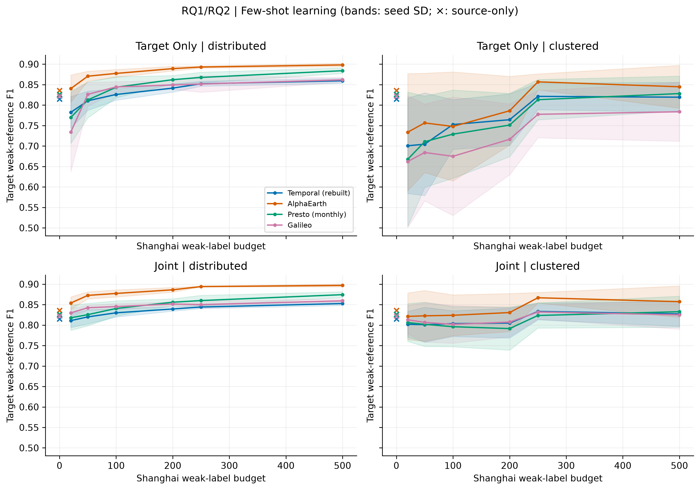
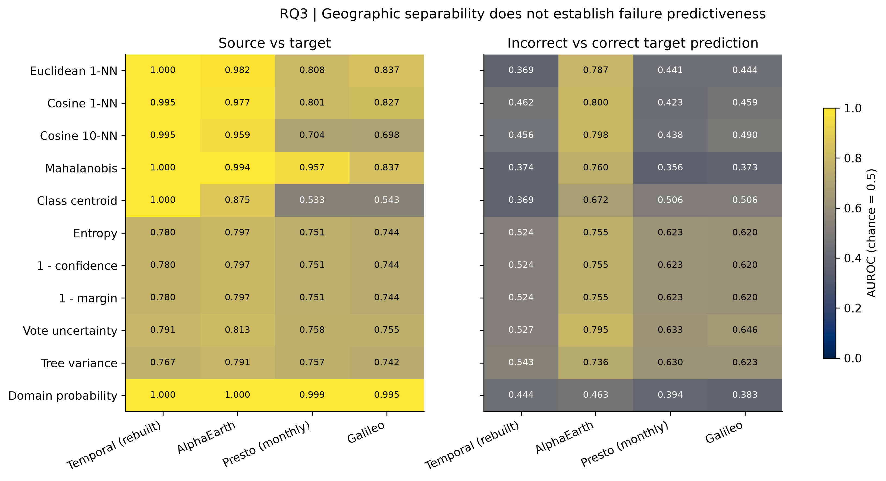
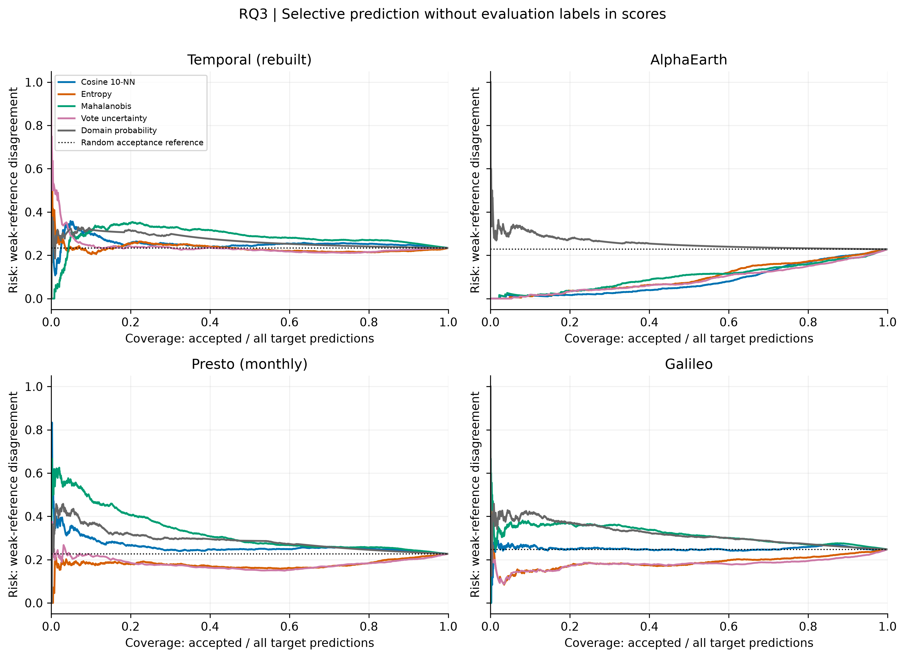

# Geographic transfer, adaptation and prediction reliability

A model that works well in Jiangxi can lose accuracy in Shanghai. This study asks
whether that loss depends on the representation, whether simple adaptation can
recover it, and whether risk scores identify predictions that should be withheld.

The comparison uses the same 13,429 sample locations and spatial splits for
Temporal-92D, AlphaEarth-64D, monthly Presto-128D and Galileo-128D. Shanghai scores
measure agreement with a product-derived weak reference, not independent field accuracy.
[Reference provenance](DATA_AVAILABILITY.md#shanghai-reference-provenance) remains incomplete.

## Representation transfer and label efficiency

| Representation | Jiangxi test F1 | Shanghai zero-shot F1 | 50 labels | 500 labels |
|---|---:|---:|---:|---:|
| Temporal (rebuilt) | 0.959 | 0.815 | 0.811 | 0.859 |
| AlphaEarth | 0.965 | 0.836 | 0.871 | 0.898 |
| Presto (monthly) | 0.949 | 0.826 | 0.813 | 0.884 |
| Galileo | 0.942 | 0.822 | 0.826 | 0.862 |

Source and zero-shot values average three frozen RF seeds. The 50/500-label
columns use target-only RFs and 30 shared, spatially distributed draws.
The [full table](results/geoai_rqs_v1/table1_representation.md) includes SD,
100/250-label results and seed counts; 250 labels uses five draws.

Under distributed, target-only training, AlphaEarth's mean F1 with 50 labels
exceeds Temporal's mean with 500. This observation is not a formal sample-complexity
result or a demonstrated tenfold reduction in annotation effort.
Zero-shot differences are less conclusive: all six
paired spatial-block intervals include zero. The ordering of mean F1 alone
does not establish a zero-shot winner.

Clustered label collection produces lower means and greater variation than
distributed collection. The budget counts labels used in training; finding a
balanced set of labels can incur additional annotation effort.

## Simple domain adaptation

The source-only and adaptation methods below use 500-tree RFs, five seeds and
the same 2,751 held-out Shanghai points. Unsupervised methods use target-pool
features, with no target evaluation data entering training.

| Representation | Source-only | CORAL | Importance weighting | Self-training | Full target pool |
|---|---:|---:|---:|---:|---:|
| Temporal (rebuilt) | 0.815 | 0.812 | 0.815 | 0.811 | 0.868 |
| AlphaEarth | 0.835 | 0.831 | 0.835 | 0.813 | 0.906 |
| Presto (monthly) | 0.826 | 0.794 | 0.824 | 0.821 | 0.902 |
| Galileo | 0.822 | 0.799 | 0.830 | 0.798 | 0.868 |

Values are mean target F1. The full-pool reference uses 9,249 weak labels.
See [all adaptation metrics](results/geoai_rqs_v1/table2_adaptation.md) for
precision, recall, AUROC, AUPRC, SD and gains over source-only. The three-seed
source means above differ slightly from these five-seed means.

**CORAL and the fixed self-training procedure did not improve any representation.**
Importance weighting gave a small gain for Galileo, but its effective source
sample size fell to about 43. Most density ratios for the other representations
hit the clipping floor. AlphaEarth's weights were entirely uniform; a unit-weight
control reproduced its result, showing that the small difference from source-only
comes from a different RF bootstrap sampling path, not useful density correction.

The results favor limited target supervision over these unsupervised methods
under the tested settings. They do not rule out other adaptation methods or settings.
The inherited few-shot models use 300 trees, so comparisons with the 500-tree
source and full-pool references also differ in model capacity.

## Domain discrimination versus failure prediction

A score can identify the target region without identifying wrong predictions.
The AlphaEarth domain classifier illustrates this: domain AUROC is 1.000, while
error-detection AUROC is 0.463. Its cosine 10-NN distance is a better failure
signal, with error AUROC 0.798.

The same cosine distance does not work across all representations: its error
AUROC is below 0.5 for Temporal, Presto and Galileo. RF uncertainty is more useful
than distance for Presto and Galileo, although less discriminative than the
AlphaEarth distance score. All eleven signals, including unsuccessful ones,
appear in [the OOD table](results/geoai_rqs_v1/table3_ood_failure.md).

### Selective prediction

Ranking AlphaEarth predictions by cosine 10-NN distance gives:

| Accepted predictions | Weak-reference disagreement |
|---|---:|
| All predictions | 22.79% |
| Lowest-risk 90% | 19.79% |
| Lowest-risk 70% | 12.62% |
| Lowest-risk 50% | 5.38% |

The ranking uses no evaluation labels. These curves describe batch selection,
not a guaranteed deployment error rate. A threshold chosen at the target-pool
median accepts 63.07% of held-out points, with 9.51% disagreement, rather than
attaining a nominal 50% coverage. Threshold transfer and ranking quality are
therefore reported separately.

## Scope and remaining questions

This is an exploratory analysis of a previously examined target set. Spatial
blocks are disjoint, but adjacent blocks and overlapping encoder context may
remain correlated. The representation systems also use different upstream
inputs, so their differences cannot be attributed solely to model architecture.

The next useful evidence is independent Shanghai field labels and an untouched
region or year. Buffered spatial evaluation, classifier sensitivity and risk
scoring after adaptation are further extensions. The current uncertainty study
uses source-only models and makes no conformal coverage claim.

## Methods, data and figures

- [Protocol and reproduction](docs/geoai_research_protocol.md)
- [Result files and figure index](results/geoai_rqs_v1/README.md)
- [Earlier four-representation study](docs/eofm_benchmark_case_study.md)
- [Data availability](DATA_AVAILABILITY.md)

The extension reuses 2,400 saved few-shot predictions and adds 250-label fits,
controlled adaptation, and eleven risk scores per representation. Per-seed
tables, hashes and complete risk–coverage data accompany the figures.
