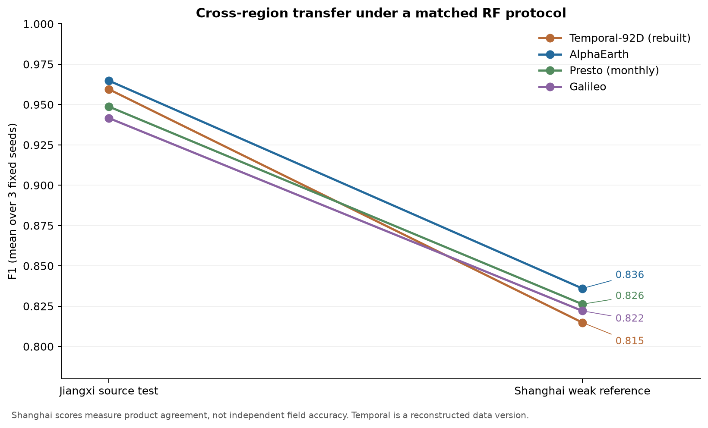
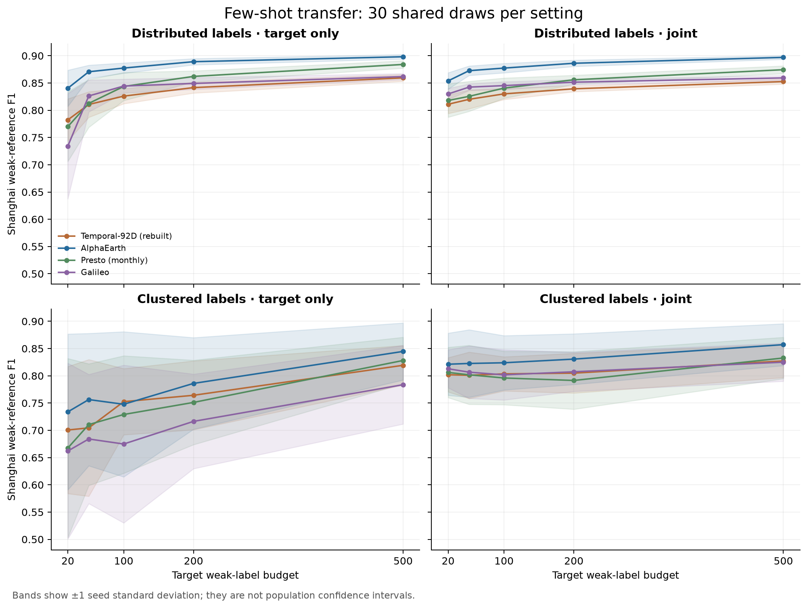
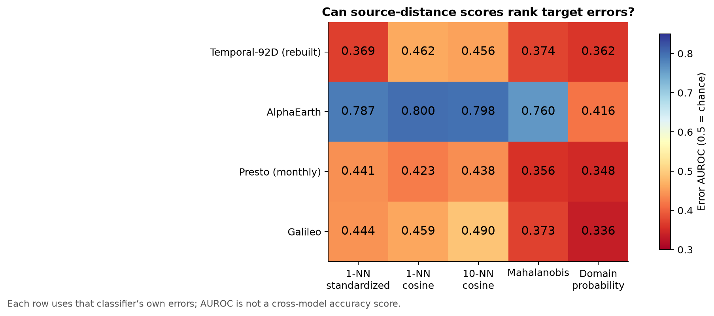

# When do foundation representations help rice transfer?

The project maps rice from Jiangxi to Shanghai and then aggregates predictions
into Chongming field parcels. This extension asks whether four frozen
representation systems support transfer, economical target-label collection,
and identification of risky predictions. It adds a matched benchmark to the
existing deployment study; the parcel classifier remains unchanged.

## Study design

All four systems use the same 1,429 Jiangxi and 12,000 Shanghai samples, spatial
splits, RF settings, and target draws. Source fitting uses 850 training rows;
265 source-validation and 314 source-test rows stay separate. Shanghai has
9,249 target-pool and 2,751 target-validation rows across disjoint blocks.
Twelve source models and their predictions were frozen before target scoring.
The 2,400 adaptation fits cover four representations, two sampling regimes,
five budgets, two training methods, and 30 shared seeds. There is no target
hyperparameter search. The [protocol](eofm_benchmark_protocol.md) specifies all
settings and the [reproduction guide](eofm_benchmark_reproduction.md) identifies
the required inputs.

## Zero-shot means do not establish a clear winner

AlphaEarth has the highest Shanghai mean F1 (0.836), followed by Presto (0.826),
Galileo (0.822), and reconstructed Temporal (0.815). However, every pairwise
95% spatial-block interval includes zero. For example, AlphaEarth minus Temporal
is +0.0211 with interval [−0.0075, 0.0427]. A mean ranking alone is insufficient
evidence of a consistent zero-shot advantage.

## Label coverage matters alongside representation

At a budget of 500 balanced target weak labels:

| Representation | Distributed, target only | Clustered, target only | Clustered, joint |
|---|---:|---:|---:|
| Temporal-92D (rebuilt) | 0.859 ± 0.006 | 0.819 ± 0.036 | 0.827 ± 0.030 |
| AlphaEarth | 0.898 ± 0.004 | 0.845 ± 0.052 | 0.857 ± 0.038 |
| Presto (monthly) | 0.884 ± 0.007 | 0.828 ± 0.043 | 0.833 ± 0.038 |
| Galileo | 0.862 ± 0.006 | 0.784 ± 0.072 | 0.825 ± 0.035 |

Values are mean F1 ± seed standard deviation, not population confidence
intervals. Target-only fitting uses the sampled target pool; joint fitting adds
source training with equal total source and target weight.

Distributed target labels give substantially more stable performance than
clustered labels under these samplers. At 500 distributed labels, AlphaEarth
exceeds Presto by 0.0141 F1 with a paired spatial-block interval
[0.0012, 0.0277]. Its corresponding differences from rebuilt Temporal and Galileo
are 0.0387 [0.0236, 0.0563] and 0.0364 [0.0221, 0.0634]. These descriptive
intervals keep the seed set fixed and are not adjusted for multiple comparisons.
The full 126 comparisons are retained in the
[paired table](../results/eofm_benchmark_v1/paired_f1_intervals.csv).

Joint training improves clustered-label mean performance at this budget, but
does not improve every distributed setting. More source data is therefore not
an automatic benefit. This is a comparison of the specified samplers, not a
causal estimate for every possible field-survey design.

## Domain separation does not guarantee error detection

The prespecified 10-NN cosine distance gives AlphaEarth error AUROC 0.798
[0.738, 0.850], compared with 0.456 for rebuilt Temporal, 0.438 for Presto,
and 0.490 for Galileo. AlphaEarth's AUPRC is 0.464 against error prevalence
0.228. Distance is useful for this representation; it is not a universal
foundation-model uncertainty score.

Domain classifiers almost perfectly distinguish Jiangxi from Shanghai, yet
their probabilities do not rank rice errors well. Permuted domain-label
controls and all negative score associations are retained. Each representation
uses its own classifier errors, so error AUROC is not a common-outcome measure
of rice classification accuracy. Scores were not reversed after evaluation.

## What this adds to the project

The extension supplies a shared-sample comparison, a repeatable label-budget
experiment, and evidence that feature-space distance must be validated for the
representation being used. It supports investigating spatially distributed
label collection and representation-specific risk diagnostics. It does not
select a new deployment model using Shanghai performance.

Shanghai scores measure agreement with a product-derived weak reference, not
independent field truth. This reference appeared in earlier project analysis;
it is not a newly untouched external holdout. Temporal uses reconstructed
2022 inputs rather than the missing historical source table. Annual AlphaEarth,
monthly Presto (with encoder-only coordinates), Galileo spatial patches, and
point temporal features differ upstream; these results compare systems and
do not isolate architecture effects. Historical headline tables remain frozen.

Evidence: [aggregate results and provenance](../results/eofm_benchmark_v1/README.md).
Independent Shanghai field labels remain the most useful next validation step.
